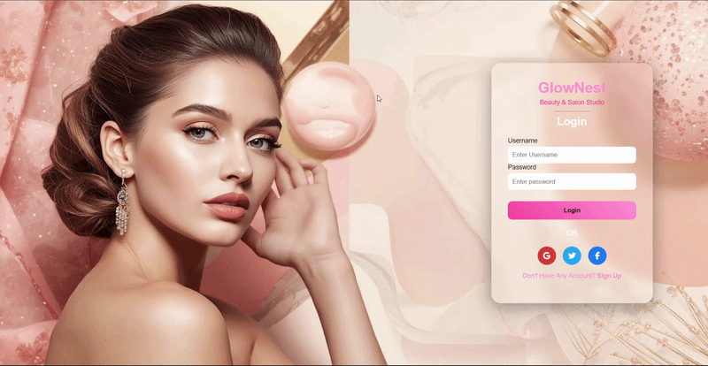

# ✨ GlowNest - Luxury Salon Login Page

A modern **Luxury Beauty Salon Login Page UI** built using **HTML, CSS, and JavaScript**.

This project focuses on building a **clean, elegant, and interactive login interface** inspired by modern beauty brand websites.

---

## 🚀 Live Demo

🌐 https://your-username.github.io/glownest-login-page

---

## 📸 Preview

## 📸  Vedio Preview

## ✨ Features

✔ Modern Luxury UI Design  
✔ Glassmorphism Login Card  
✔ Smooth UI Animations  
✔ Social Login Icons  
✔ JavaScript Form Validation  
✔ Sparkle Background Animation  

---

## 🛠️ Tech Stack

| Technology | Usage |
|-----------|------|
| HTML5 | Page Structure |
| CSS3 | UI Design & Animations |
| JavaScript | Login Validation & Interaction |
| Font Awesome | Social Icons |

---

## 📂 Project Structure

